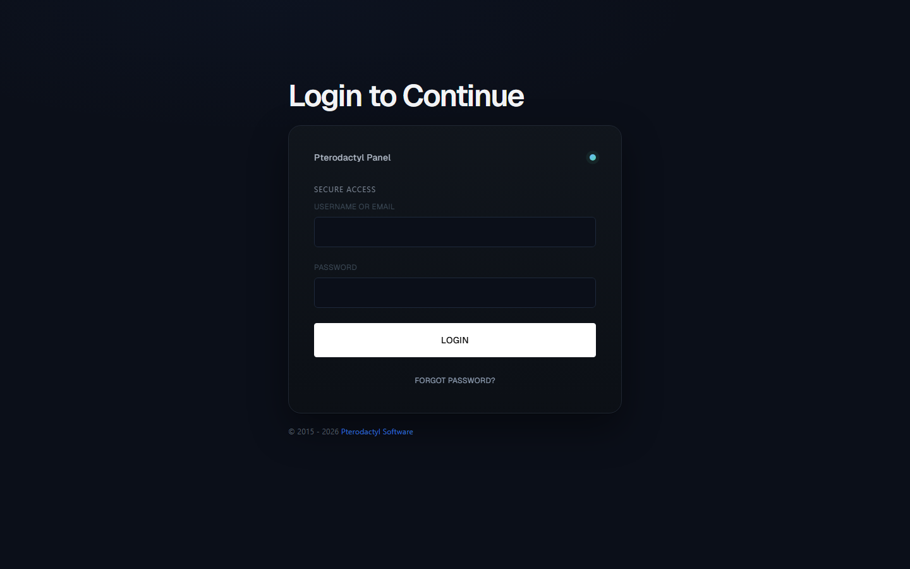
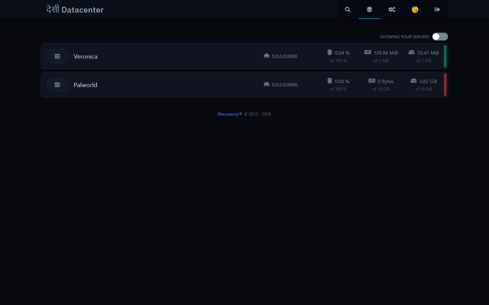
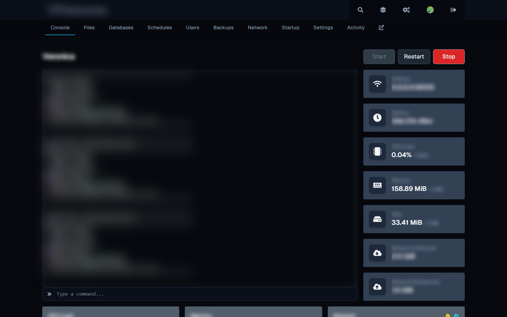
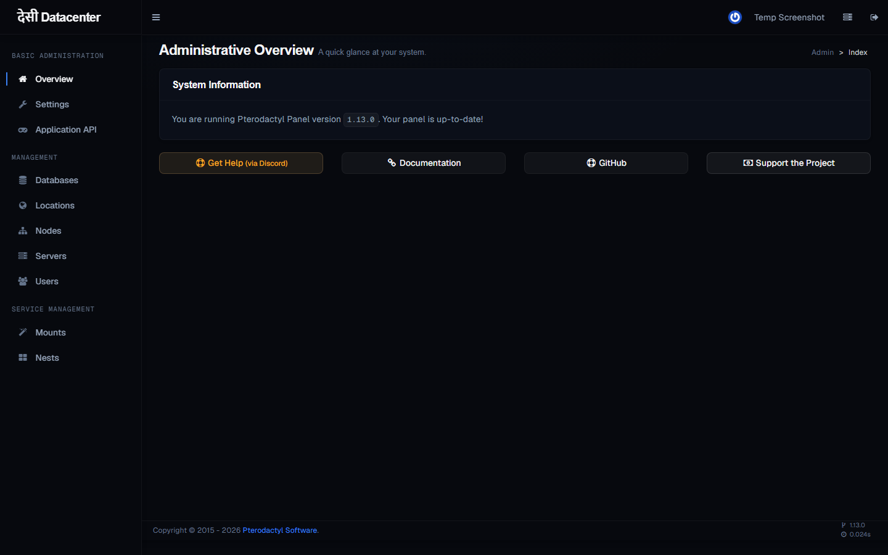

# Elipso — Premium Dark Theme for Self-Hosted Pterodactyl Game Panels

Transform your self-hosted Pterodactyl panel into a premium, modern experience. Elipso brings a Vercel-inspired dark aesthetic to your game server hosting panel — making it look professional, feel fast, and stand out from every other host.

Built for self-hosters, game server providers, and anyone running Pterodactyl who wants their panel to look as good as their servers run.






## Why Elipso?

**Stop looking like every other panel.** The default Pterodactyl theme is functional but generic. Elipso transforms it into a Vercel-caliber dark experience — near-black canvas, Geist typography, and purposeful whitespace. Your users will notice the difference immediately.

**Perfect for self-hosted game servers.** Minecraft, Valheim, Palworld, Rust — whatever you're hosting, Elipso gives your panel a professional edge. One command, instant transformation.

**Dark-only, done right.** True dark mode designed for extended use. Easy on the eyes during late-night server management, with carefully chosen contrast ratios that keep everything readable.

## Features

- **Vercel-inspired design** — near-black canvas with white ink, just like Vercel's dashboard
- **Geist & Geist Mono** — the same typeface used by Vercel, for a modern technical feel
- **Mesh gradient auth pages** — subtle atmospheric gradients on login screens
- **Full dark theme** — consistent dark styling across both the React client and Blade admin panel
- **One-command install** — automatic backup, safe revert, zero configuration
- **Free & open source** — MIT licensed, no premium upsells

## Quick Install

```bash
curl -sL https://raw.githubusercontent.com/instax-dutta/elipso-theme/main/install.sh -o /tmp/elipso.sh && sudo bash /tmp/elipso.sh
```

The installer backs up your panel, applies the theme, clears caches, and fixes permissions. Your original panel is always one restore away.

## After Install

Hard refresh your browser (Ctrl+Shift+R / Cmd+Shift+R) or open an incognito window to see the new theme immediately.

## Revert

Restore from the automatic backup:

```bash
sudo cp -a /var/www/elipso-backup-YYYYMMDD-HHMMSS/* /var/www/pterodactyl/
```

Backups are created at `/var/www/elipso-backup-<timestamp>/` during installation.

## License

MIT
